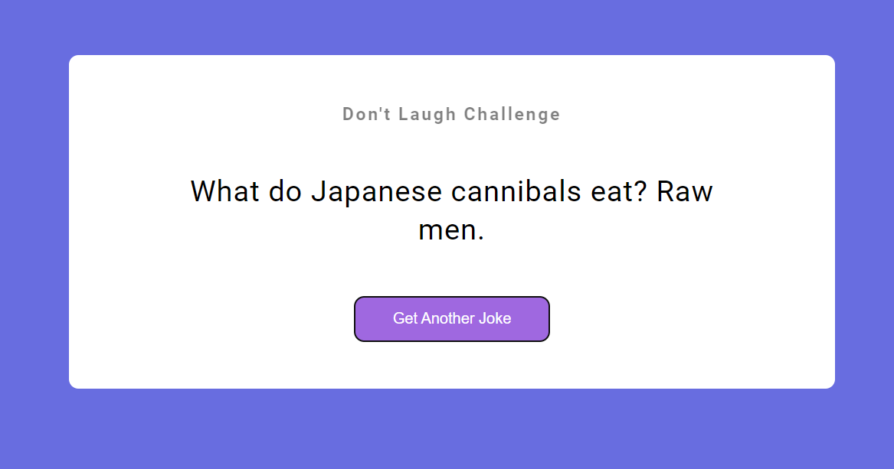

# Description
This project is part of JS assignment Challenge. It uses the jokeapi API, its free to use and does not require authentication token. It shows you one joke at a time. Enjoy the Jokes 

## Time Taken

1 hour approximately

[Live Demo](https://jokegen-akj.netlify.app/)

### SnapShot of the program

